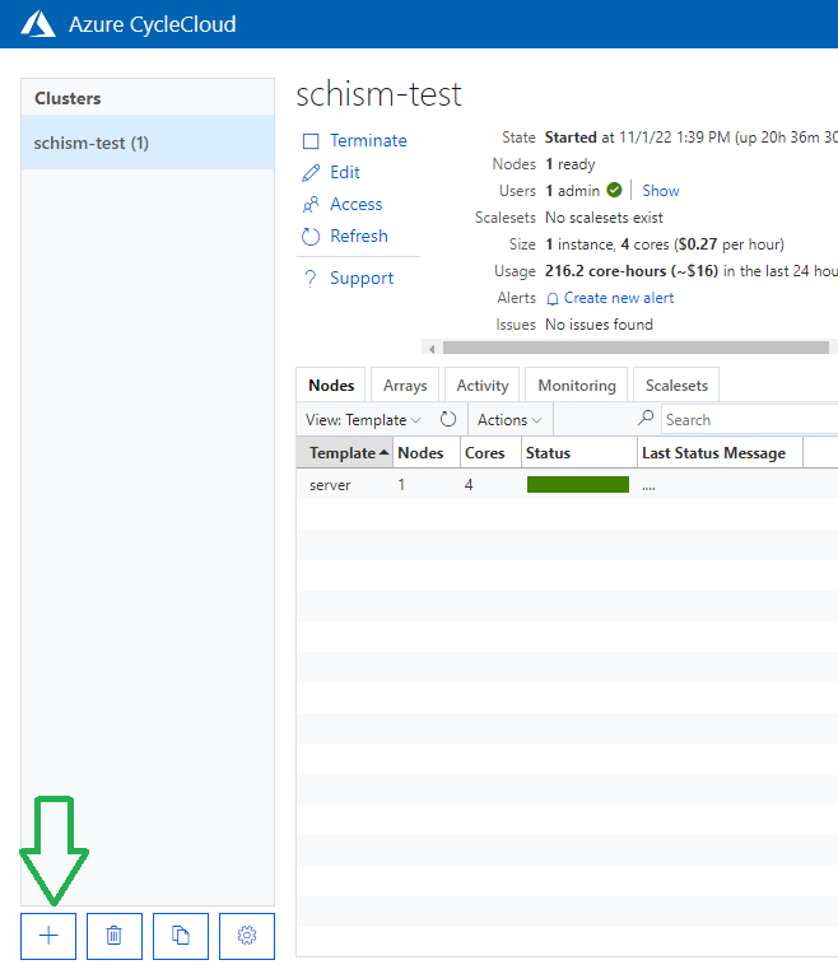
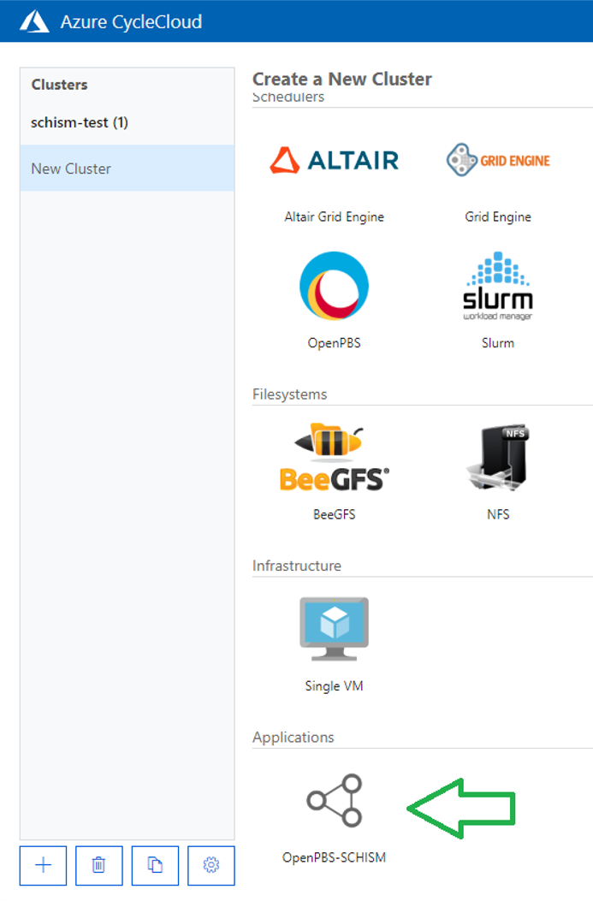
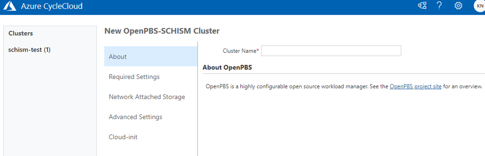
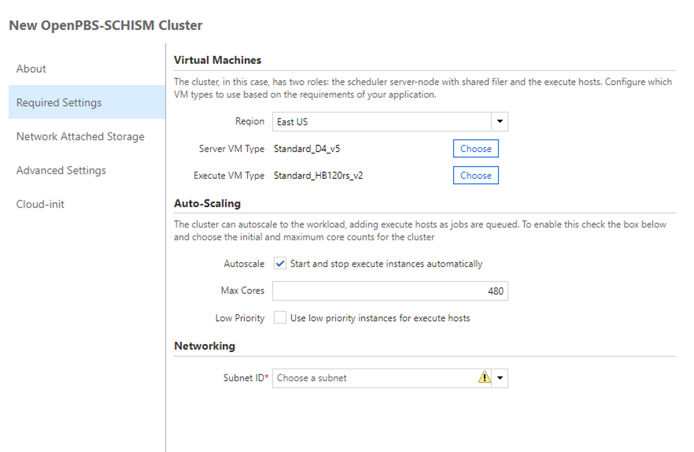
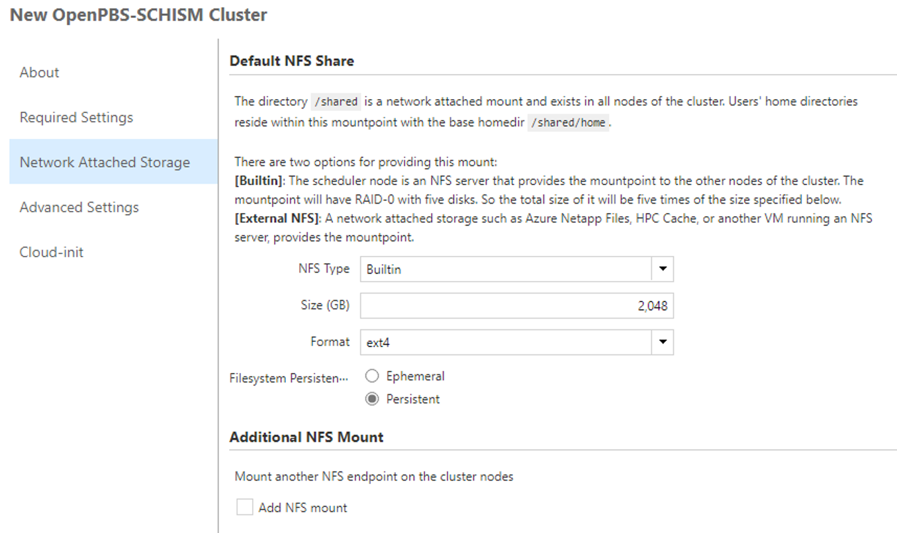
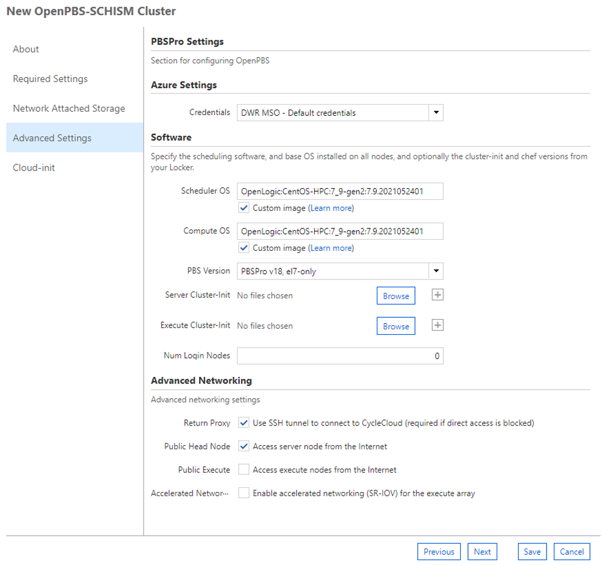
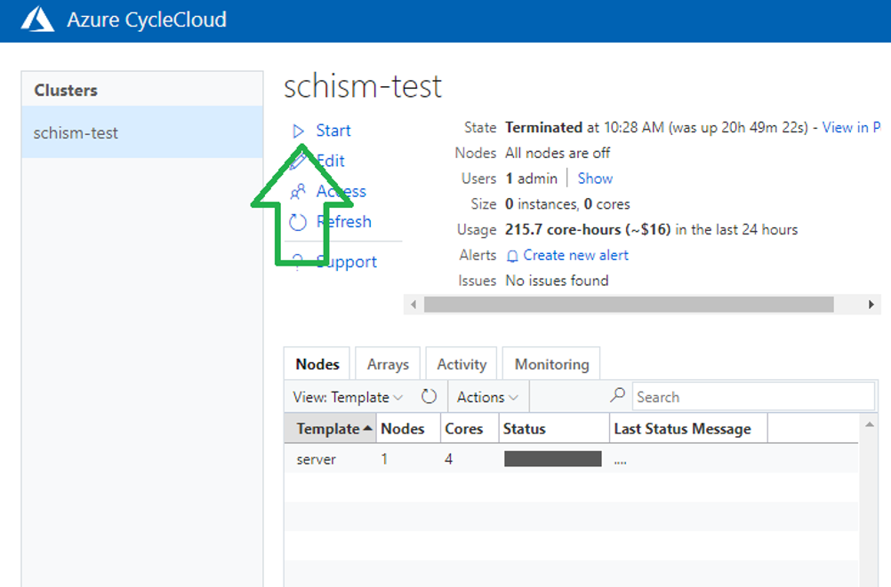
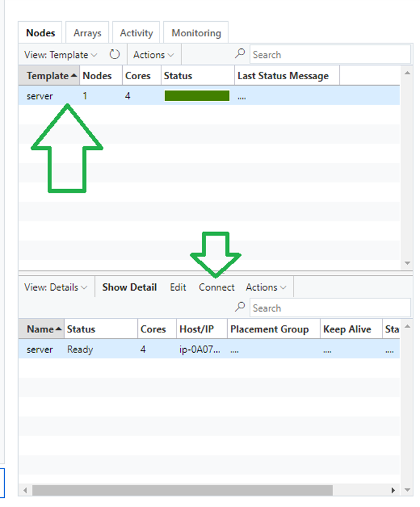
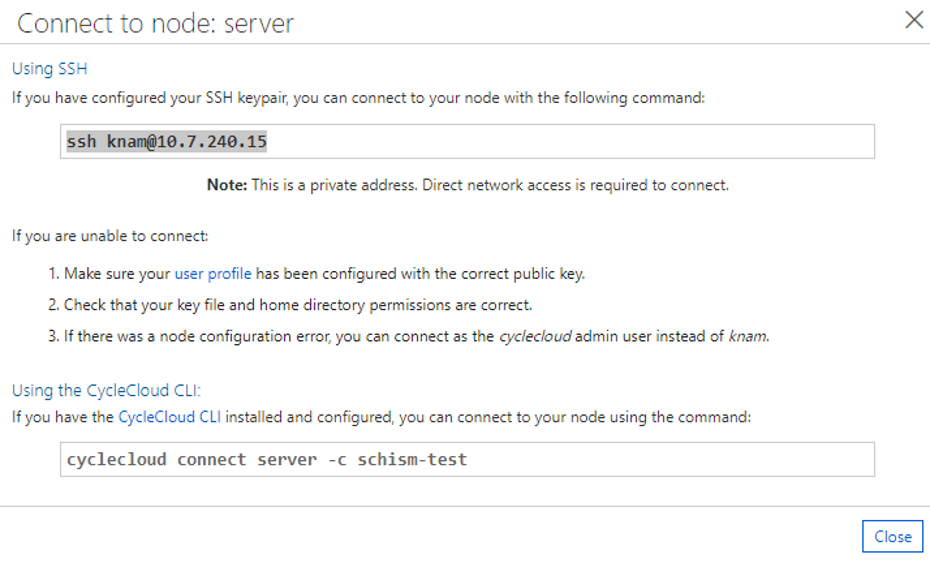

# How to create a CycleCloud cluster computer for SCHISM on Azure

## Introduction

Generally, there are five steps in preparing CycleCloud and virtual SCHISM cluster computers, with some of them being one-time tasks.

1. Get an Azure subscription and account.
2. Install and configure CycleCloud. These steps are client-dependent and well-documented.
3. Import the customized cycle cloud specification from the spec we put on GitHub.
4. Create a cluster.
5. Run SCHISM.

## Create a CycleCloud App
CycleCloud is an online application (or tool) to create and manage virtual cluster computers in Azure. Microsoft Documents for CycleCloud can be found at [Azure CycleCloud Documentation - Azure CycleCloud - Microsoft Learn](https://learn.microsoft.com/en-us/azure/cyclecloud/?view=cyclecloud-8).

To create a CycleCloud app, follow a Microsoft documentation from here, [Quickstart - Install via Marketplace - Azure CycleCloud - Microsoft Learn](https://learn.microsoft.com/en-us/azure/cyclecloud/qs-install-marketplace?view=cyclecloud-8).

You may need to give a ‘contributor’ role to an Azure App for CycleCloud when you use ‘service principal’ approach. See this [Microsoft documentation regarding this: Using a Service Principal - Azure CycleCloud - Microsoft Learn](https://learn.microsoft.com/en-us/azure/cyclecloud/how-to/service-principals?view=cyclecloud-8).

The user will be asked to create a CycleCloud Web admin account and to provide some Azure account information in the process such as tenant ID.

It is recommended to provide an SSH public key when the first user account is created. This CycleCloud user account and a set of SSH key will be used later to log in to cluster computers, thus please keep the SSH key set. (You can generate SSH keys and store through the Azure portal as well: [Create SSH keys in the Azure portal - Azure Virtual Machines - Microsoft Learn](https://learn.microsoft.com/en-us/azure/virtual-machines/ssh-keys-portal).)

## Import CycleCloud SCHISM Project
A CycleCloud project is a recipe to create a cluster from a template. To create a cluster for SCHISM easily, a CycleCloud project is customized. The project is available at [GitHub, CADWRDeltaModeling/cyclecloud-pbspro-schism: Example Azure CycleCloud PBSpro cluster type](https://github.com/CADWRDeltaModeling/cyclecloud-pbspro-schism).

### Initialize CycleCloud
To use a CycleCloud project, a user needs to log (SSH) into the CycleCloud server command line environment and to initialize the CycleCloud service. A CycleCloud server (VM) admin account, not the CycleCloud Web admin account) and a key (text key inside a file) are necessary. The initialization is needed only once.

Run a command shown below to initialize CycleCloud (Note that $ denotes a prompt. Do not type it):

    $ cyclecloud initialize

It will ask a few user inputs. Use the CycleCloud admin user account information created in the previous step. Accept default options for others.

This step will set up locker information. Get the locker name for later use:

    $ cyclecloud locker list

Please refer to the CycleCloud CLI (Command Line Interface) documentation at [Azure CycleCloud CLI Reference - Azure CycleCloud - Microsoft Learn](https://learn.microsoft.com/en-us/azure/cyclecloud/cli?view=cyclecloud-8#cyclecloud-initialize) for more information about it.

### Import the SCHISM CycleCloud project
To create a cluster that is ready to run SCHISM, the CycleCloud-PBSPro-SCHISM project can be imported into CycleCloud Service. Please refer to a [Microsoft document about CycleCloud project from Projects - Azure CycleCloud - Microsoft Learn](https://learn.microsoft.com/en-us/azure/cyclecloud/how-to/projects?view=cyclecloud-8) for more information.

First, log (SSH) into the CycleCloud server. Download one of SCHISM CycleCloud project files (source code file in zip or tar.gz, ) from a [GitHub release page at Release CycleCloud-PBSPro SCHISM Project v1.3.8_v5.8 Intel 2022.2 MPI · CADWRDeltaModeling/cyclecloud-pbspro-schism (github.com)](https://github.com/CADWRDeltaModeling/cyclecloud-pbspro-schism/releases/tag/v5.8.0-schism) and unpack it.

Navigate the unpacked project directory. Create a directory named ‘blobs’ and download assets (rpm files and schism.5.8_intel2021.2.tar.gz) from the GitHub release page to the blobs directory.

Build the project and upload project files and assets to the locker that is created in the initialization step as shown below. The locker name may need to be surrounded with quotation marks if the name contains spaces.

    $ cyclecloud project build
    $ cyclecloud project upload locker_name

Import the project template to the CycleCloud service.

    $ cyclecloud import_template -f templates/openpbs-schism.txt

Now OpenPBS-SCHISM should show up in the list of cluster templates.

## Create a Cluster
Open the CycleCloud Web in a browser. Log into the CycleCloud web interface with the admin account of the CycleCloud Web.

Click ‘+’ icon at the lower left corner. Choose ‘OpenPBS-SCHISM’ at the bottom of the list.

Select options that you need step by step.

Enter a cluster name (as shown below) and click ‘Next’ at the bottom:

Choose an Azure region, VM types, the auto-scaling limit, and a subnet in the list of the subnets as show below. Good VM types for a server node are general purpose D-series or computational F-series with appropriate sizes, at least 4 to 8 cores. Compute node VM types should be HB or HC series. HB120rs series are the latest and the most cost-effective types, and they are recommended. Note that the node type may be available only in some Azure regions. The scaling limit of 480 cores would be good for four HB120rs nodes. The quota of those node types may need to be increased first accordingly. CycleCloud will provision server and compute nodes in a subnet that is chosen here. A subnet may need to be created in the selected region above. See this Microsoft Document at Add, change, or delete an Azure virtual network subnet - Microsoft Learn to find out how to create a subnet. Subnets in the selected region will show up the option list.

Enter the size of a disk in a five-disk RAID. For example, the default option of 2,048 GB will provide about 10TB of disk space for /shared/home directory. 10TB workspace would be enough to hold outputs from several typical Bay-Delta SCHISM runs though the size of outputs vary highly depending on the output options. The cost of the disks can be high when they are kept alive for a long period.

If a filesystem persistence option, ‘Ephemeral,’ is chosen, the builtin RAID drive will be deleted and the data on the drive will be lost when a cluster is stopped later. The other option, ‘Persistent,’ does not delete the RAID drive even when a cluster is stopped.

Choose a credential, and a public head node option if necessary. There would be only one credential option that is created while the CycleCloud Service is set up (unless more are added later.) If users need to access clusters from the Internet directly, not through the Azure internal subnet routing, or if you are not sure about the network settings, enable the public head node option. For other options, default options are good for the SCHISM cluster setting.

The last section for `Cloud-init` does not need to change. Click ‘save’ at the bottom right.

Now a new cluster will show up in the list of the cluster computers. Choose one that is just created. Click ‘start’ in the cluster information. It will spin up a server node of the cluster, and this may take five to ten minutes.

## Launch a SCHISM simulation
Once a server node is created, i.e. provisioned, and is running, it would behave just like any other Linux server. You may need the SSH private key when the first user account of the CycleCloud Web is created. If you can log (SSH) into the server node, it is ready to use and to launch SCHISM runs. To find out how to connect to the server node, select the server node in the node list first, and click ‘Connect’ below when the server node information shows up. A pop-up window will appear with an instruction and an IP address of the server node similar to a screenshot shown below. (Note that your connection information will be different from the example below.)

The first step to prepare a SCHISM run would be uploading SCHISM input files to a user’s home directory. Once simulation input files are uploaded to the cluster computer, a job can be launched from the base of a simulation input directory. A sample PBSPro launch file and a SCHISM script are available from the GitHub release page (sample_scripts.tar.gz). They are customized for this SCHISM CycleCloud cluster. The launch file may need to be modified with user information and run settings, for example, user email information to receive notifications, a job name, the number of cores or nodes (defaults should work fine). See PBS script guides such as this one, [Creating a PBS script - LATIS Research (umn.edu)](https://latisresearch.umn.edu/creating-a-PBS-script), to learn more about PBS options.

After editing the launch file, submit the job to the job queue:

     $ qsub launch.pbs

Once a job is submitted, CycleCloud will automatically start provisioning the required number of compute nodes. It takes typically five to ten minutes to finish provisioning. When compute nodes are ready, a job will start running on them. When the job finishes, CycleCloud will scale down, i.e. terminate, compute nodes automatically. Results of a simulation will be saved under `outputs` directory.